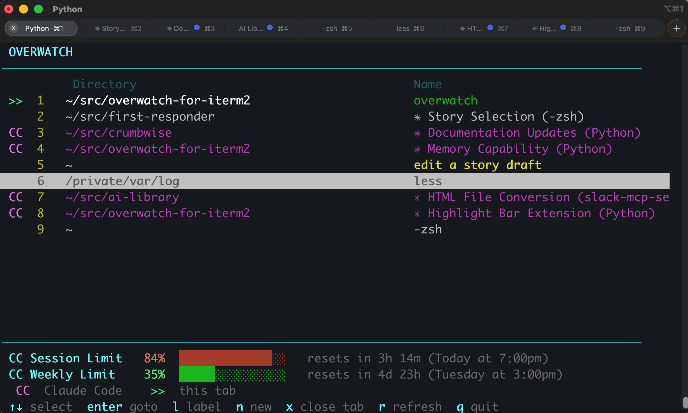

# Overwatch for iTerm2

A live terminal dashboard for your iTerm2 tabs. See every tab's working directory and session name at a glance, with special highlighting for [Claude Code](https://claude.ai/code) sessions.



## Features

- **Live tab list** — shows current directory and session name for every tab across all windows
- **Claude Code detection** — automatically identifies tabs running Claude Code and highlights them in magenta
- **Tab switching** — press Enter to jump to any tab
- **Tab labels** — press l to set a custom label for any tab, shown in yellow; clears when overwatch exits
- **New tab** — press n to open a new tab
- **Tab closing** — press x then y to close a tab (with confirmation)
- **Claude Code usage limits** — when Claude Code is running, shows session (5h) and weekly (7d) utilization with color-coded progress bars and reset countdowns
- **Auto-refresh** — tabs update every 10 seconds, usage limits every 2 minutes, or press r to refresh everything
- **Zero dependencies** — just Python 3.7+ and macOS

## Install

```bash
# Clone
git clone https://github.com/ericburns/overwatch-for-iterm2.git

# Symlink to your PATH (always runs the latest)
ln -sf "$(pwd)/overwatch-for-iterm2/overwatch" /usr/local/bin/overwatch
```

Or just copy the single `overwatch` file anywhere on your `$PATH`.

## Usage

```
overwatch
```

### Keys

| Key | Action |
|-----|--------|
| `↑` `↓` | Navigate tabs |
| `Enter` or `g` | Switch to selected tab |
| `l` | Set or edit a label for the selected tab |
| `n` | Open a new tab |
| `x` | Close selected tab (asks for confirmation) |
| `r` | Refresh tab list and usage data |
| `q` or `Esc` | Quit overwatch |

### Tab badges

| Badge | Meaning |
|-------|---------|
| `CC` | Tab is running Claude Code (magenta) |
| `>>` | Tab running overwatch itself (green) |

## How it works

Overwatch uses AppleScript to query iTerm2 for tab metadata (session name, working directory, TTY) and `ps` to detect which TTYs have a `claude` process. Usage limits are fetched from the Anthropic API using your Claude Code OAuth token (stored in macOS Keychain). Everything runs through macOS built-ins — no iTerm2 plugins or shell integration required.

## Requirements

- macOS
- iTerm2
- Python 3.7+
- Claude Code (for usage limits feature — optional)

## License

MIT
